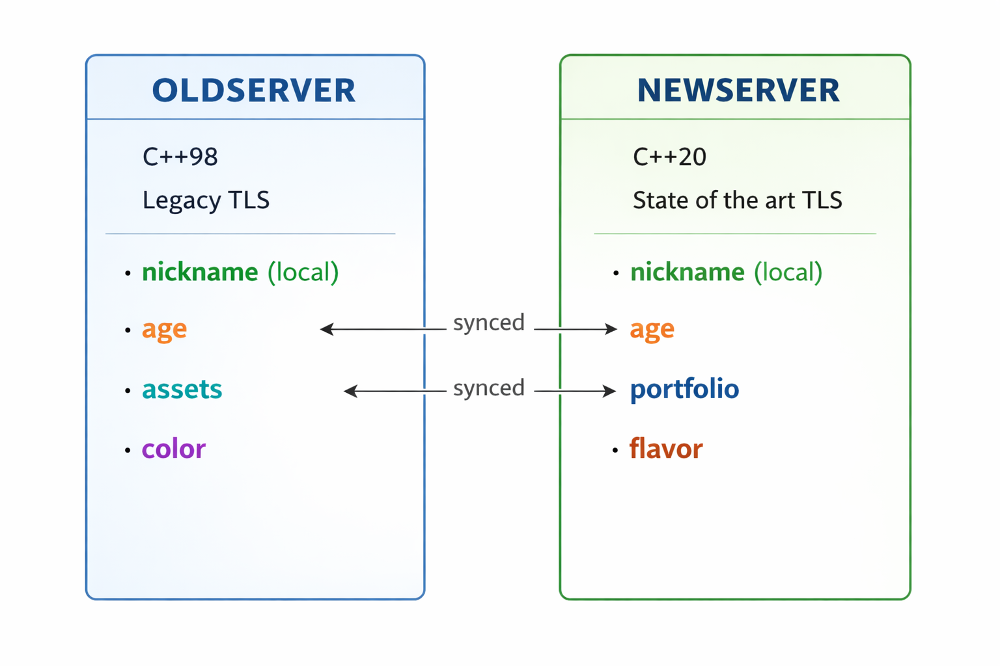

# BusyDemo

This project demonstrates information sharing and `shared nothing` synchronization between two projects , one based on new the other a legacy TLS.

It has two servers oldserver and newserver

oldserver is built
- On C++98
- using a legacy TLS framework
- Has the following items
  - `nickname` : user can set his/her nickname , this is local to oldserver
  - `age` : user can set age
  - `assets`  : user assets
  - `color` : a functionality on oldserver not required in newserver.
  - `/oldapi/setuser` sets both `nickname` and `age`
  - `/oldapi/setdata` sets both `assets` and `color`

newserver is built
- On C++20
- using a state-of-the-art TLS framework
- Has the following items
  - `nickname` : user can set his/her nickname , this is local to newserver
  - `age` : user can set age, but `age` is automatically synced between oldserver and newserver if both are running
  - `portfolio` : in newserver portfolio replaces assets, but `portfolio` must be synced to oldserver `assets` if running.
  - `flavor` : completely new functionality on newserver.
  - `/newapi/setuser` sets both `nickname` and `age`
  - `/newapi/setdata` sets both `assets` and `color`

# See Also

- see [setup](./SETUP.md)
- see [architecture](./ARCHITECTURE.md)
